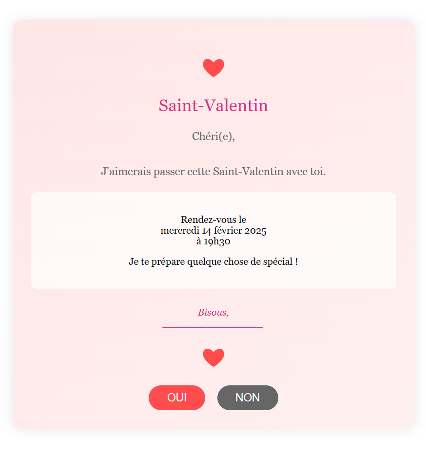

#  LoveLetter

## 🚀 Aperçu de la carte d'invitation

🔗 <u>[Accédez à l'inivation](https://enzo-love.netlify.app)</u>

  
  

## ✨ Fonctionnalités

*   **Animation de cœurs :** Des cœurs flottants sont générés lorsque l'utilisateur clique sur le bouton "OUI".
*   **Bouton "NON" interactif :** Le bouton "NON" rétrécit à chaque clic et affiche des messages amusants.
*   **Notifications :** Des notifications apparaissent pour donner un retour à l'utilisateur.

## 🛠️ Technologies utilisées  

*   **HTML :** Structure la page web et le contenu de l'invitation.
*   **CSS :** Met en forme l'invitation et ajoute des styles visuels attrayants.
*   **JavaScript :** Crée les animations interactives, gère les notifications et la logique du bouton "NON".
*   **Git/GitHub :** Permet de gérer le code source, de collaborer et de partager le projet.
*   **Netlify :** Héberge le site web et le rend accessible en ligne.

## ⚙️ Comment lancer le projet en local

1.  Clonez le dépôt : `git clone https://github.com/enzo-mensier/LoveLetter.git`
2.  Ouvrez le fichier `love.html` dans votre navigateur.
